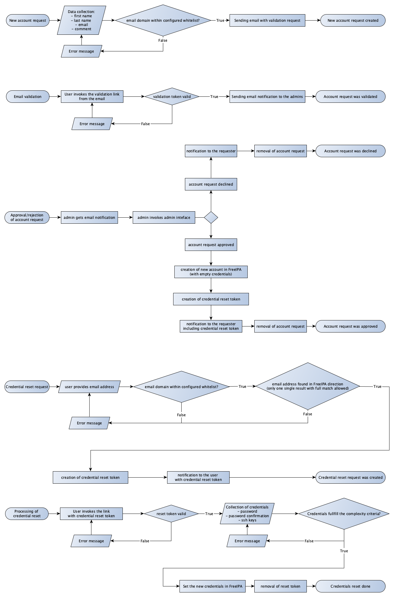

# Auri

[](https://github.com/auri/auri/blob/master/LICENSE)
[](https://GitHub.com/auri/auri/graphs/commit-activity)
[](http://golang.org)
[](https://gobuffalo.io/)
[](https://goreportcard.com/report/github.com/auri/auri)

[](https://GitHub.com/auri/auri/releases/)
[](https://github.com/auri/auri/actions/workflows/auri.yml)
[](https://copr.fedorainfracloud.org/coprs/auri/releases/package/auri/)

Auri stands for: `A`utomated `U`ser `R`egistration `I`PA

Auri implements [self service account creation and reset of credentials](https://www.freeipa.org/page/Self-Service_Password_Reset) for [FreeIPA](https://www.freeipa.org/)

## Features

- Requesting of accounts with validation workflow (see below)
- Whitelisting of allowed domains
- Self-service reset of password and/or SSH keys
- Designed to store as less data as possible (e.g. no secrets are stored)
- Logging of all IPA operations
- Logging of all interactions (e.g. account request, approval actions)

## Workflow



## Requirements

- Linux (RH family)
- PostgreSQL (tested with PostgreSQL 12)
- FreeIPA (tested with FreeIPA 4.6.8 on CentOS 7)

## Installation and configuration

Install and configure PostgreSQL (see [this](https://www.digitalocean.com/community/tutorials/how-to-install-and-use-postgresql-on-centos-7) HowTo). Create a database and according user.

Use the [Fedora COPR repository](https://copr.fedorainfracloud.org/coprs/auri/releases/) for auri installation:

```bash
$ wget -O /etc/yum.repos.d/auri.repo \
       https://copr.fedorainfracloud.org/coprs/auri/releases/repo/epel-8/auri-releases-epel-8.repo
# on EL7
$ yum install auri
# on EL8 and Fedoro
$ dnf install auri
```

Auri RPM file contains two configuration files with default settings:

- `/etc/auri/database.yml` - DB connection settings
- `/etc/auri/config.env` - configuration file for auri

Change the configuration files as needed and set the mandatory configuration options. Keep in mind to restart auri in case of configuration changes.

Update the database scheme, enable and start auri:

```bash
$ auri migrate
$ systemctl enable auri
$ systemctl start auri
```

Create the maintenance cronjobs for removal of expired requests and tokens:
```bash
$ cat > /etc/cron.d/auri <<EOF
0 3 * * * root auri task cleanup_requests && auri task cleanup_reset_tokens
EOF
```

Create a user in IPA for auri and add it's credentials to the `config.env`:
```bash
# following commands should be executed on the FreeIPA system
# you have to adapt your LDAP tree for your setup, we use 'dc=example,dc=com' here
$ kinit admin
...
# create a new permission to add new users to the default group
$ ipa permission-add 'Auri - Add Users to default user group'\
      --right=write --subtree='cn=groups,cn=accounts,dc=example,dc=com'\
      --target='cn=#{users_group},cn=groups,cn=accounts,dc=example,dc=com'\
      --attrs=member

# create a new privelege for auri
$ ipa privilege-add 'Auri account management' --desc 'Account creation and credential reset via Auri'
$ ipa privilege-add-permission 'Auri account management' --permissions='System: Add Users'
$ ipa privilege-add-permission 'Auri account management' --permissions='System: Change User password'
$ ipa privilege-add-permission 'Auri account management' --permissions='System: Manage User SSH Public Keys'
$ ipa privilege-add-permission 'Auri account management' --permissions='System: Read UPG Definition'
$ ipa privilege-add-permission 'Auri account management' --permissions='Auri - Add Users to default user group'

# create a new role for auri
$ ipa role-add 'M2M Auri account manager' --desc 'Account creation and credential reset via Auri'
$ ipa role-add-privilege 'M2M Auri account manager' --privileges='Auri account management'

# create a new auri user
$ ipa user-add auri --password \
      --shell=/sbin/nologin --home=/nonexistent \
      --first=auri --last=auri
# avoid password change flag and unlock auri account
$ ipa user-mod auri --setattr krbPasswordExpiration=del --delattr krbPasswordExpiration=del
# assign auri role to the user
$ ipa role-add-member 'M2M Auri account manager' --users=auri
```

**Setup a forward proxy and ensure `/admin` URL path is protected.**
Following example shows a possible configuration with apache web server and accounts from IPA admin group:
```
# httpd.conf or similar part of apache configuration

# SSL configuration
Listen *:443
SSLCertificateFile /etc/pki/httpd/certificate.crt
SSLCertificateKeyFile /etc/pki/httpd/certificate.key
SSLCertificateChainFile /etc/pki/httpd/chain.crt

# https://bettercrypto.org/#_apache
SSLProtocol All -SSLv2 -SSLv3
SSLHonorCipherOrder On
SSLCompression off
Header always set Strict-Transport-Security "max-age=15768000"
SSLCipherSuite 'EDH+CAMELLIA:EDH+aRSA:EECDH+aRSA+AESGCM:EECDH+aRSA+SHA256:EECDH:+CAMELLIA128:+AES128:+SSLv3:!aNULL:!eNULL:!LOW:!3DES:!MD5:!EXP:!PSK:!DSS:!RC4:!SEED:!IDEA:!ECDSA:kEDH:CAMELLIA128-SHA:AES128-SHA'

# global LDAP settings
LDAPTrustedGlobalCert CA_BASE64 /etc/ssl/certs/ca-bundle.crt

<VirtualHost *:80>
  Redirect permanent / https://auri.example.com/
</VirtualHost>

<VirtualHost *:443>
ServerName auri.example.com
SSLEngine on

ProxyPassReverseCookiePath / /
ProxyRequests off
ProxyPreserveHost on
ProxyPass "/" http://localhost:3000/
ProxyPassReverse "/" http://localhost:3000/

<Location /admin>
  AllowOverride none
  AuthType Basic
  AuthName "Admin area"
  AuthBasicProvider ldap
  AuthLDAPURL "ldaps://ipa1.example.com ipa2.example.com:636/cn=users,cn=accounts,dc=example,dc=com"
  AuthLDAPBindDN "uid=auri,cn=users,cn=accounts,dc=example,dc=com"
  AuthLDAPBindPassword "PASSWORD"
  Require ldap-group cn=admins,cn=groups,cn=accounts,dc=example,dc=com
</Location>

</VirtualHost>
```

## URLs

Auri binary provides several URL paths (routes) for different parts of it's functionality:
- `/accountrequest` (default) - request of new accounts
- `/emailvalidation` - used for validation of email addresses
- `/credentialreset` - Reset of authentication credentials
- `/admin` - Admin interface for confirmation/rejection of account requests

**Please keep in mind: `/admin` isn't protected, you have to setup a reverse proxy with some kind of protection!**

## Tasks

Auri binary provides several maintenance tasks, see `auri --help` and `auri task list` for more details.

## Development environment

This repository contains a `Vagrantfile`,
so you can start the development environment via vagrant in a virtual machine like this:

1. Install [vagrant](https://www.vagrantup.com/downloads)
1. Install [virtualbox](https://www.virtualbox.org)
1. Clone the repository
1. Invoke `vagrant up` and grab a coffee

Invoke `vagrant ssh` to get to the VM, invoke `buffalo dev` in the VM in order to start Auri in the development mode.
You can set the configuration parameters in the development mode via creating the `.env` file in the top-level.
See [the configuration file](rpm/assets/config.env) for possible options.

Unit tests can be executed using the prepared configuration file:

```bash
$ cp fixtures/testing-config.env .env
$ make test
...
```

## Authors

Auri was a trainee project within [Deutsche Telekom Security GmbH](https://github.com/telekom-security).
We assume our problem and solution are generic enough to be interesting for others, so we decided to open source it :-)
Any help with maintenance of Auri is welcome and appreciated!

* [Daniel Ajbassow](https://gitlab.com/danielajbassow) - Auri initial development as part of trainee program
* [Mohamad Asswad](https://gitlab.com/masswad) - Auri initial development as part of trainee program
* [Sergej Schischkowski](https://github.com/pycak) - mentoring and support of trainees
* [Artem Sidorenko](https://github.com/artem-sidorenko) - mentoring and support of trainees

## Acknowledgments

- [Go programming language](https://golang.org)
- [Go Buffalo Framework](https://gobuffalo.io/)
- [Go library for FreeIPA](https://github.com/tehwalris/go-freeipa)

## Related and similar projects

- http://freeipa.org - OpenSource identity management
- https://github.com/ubccr/mokey - Self-service account management
- https://github.com/pwm-project/pwm - Self-service password service

## License

This project is licensed under the MIT License - see the [LICENSE](LICENSE) file for details.
